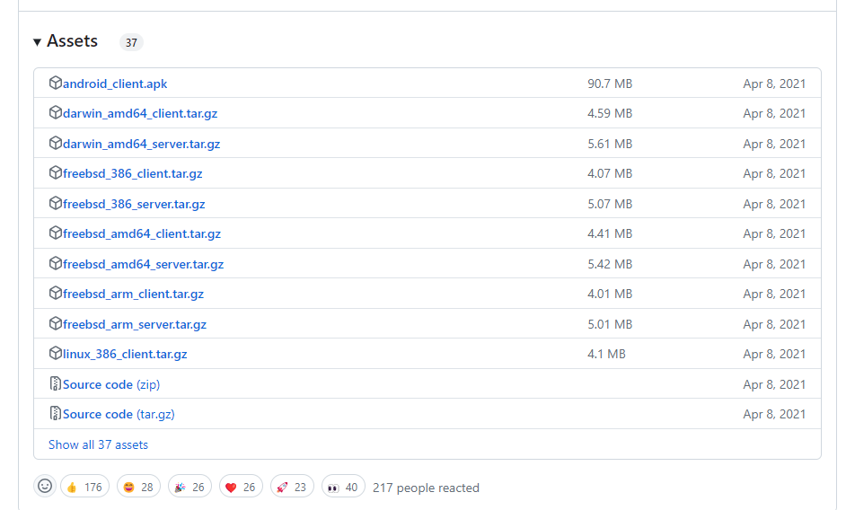
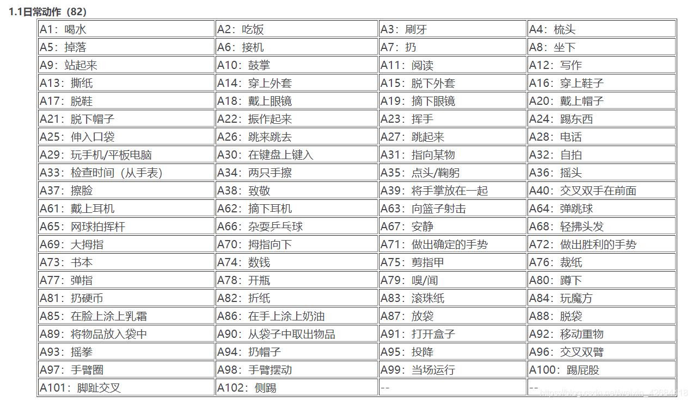
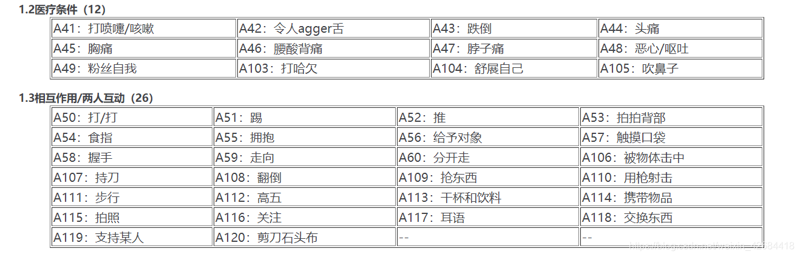

# PyTorch

搭建环境

https://blog.csdn.net/wyf2017/article/details/118676765

环境配置细节

[Conda虚拟环境](https://blog.csdn.net/fs1341825137/article/details/109681541)

[jupyter server](https://blog.csdn.net/fs1341825137/article/details/109683965)

```bash
source /home/lzh/anaconda3/etc/profile.d/conda.sh

conda create -n pytorch-test

conda activate pytorch-test
```


conda虚拟环境list

```
bashCopy code
conda env list
```


安装pytorch

https://blog.csdn.net/Friedrichor/article/details/127721828

检验 PyTorch 安装成功
在终端依次输入 python，import torch，torch.__version__，torch.cuda.is_available()，就可以检验 PyTorch 是否安装成功，并可查看版本号等等。

```bash
(pytorch) kfh@amax:~$ python  # 进入python环境
Python 3.9.13 (main, Oct 13 2022, 21:15:33) 
[GCC 11.2.0] :: Anaconda, Inc. on linux
Type "help", "copyright", "credits" or "license" for more information.
>>> import torch   # 输入并按回车后只要不报错就说明pytorch已经安装成功了
>>> torch.__version__  # 查看 PyTorch 版本号
>>> '1.12.1'
>>> torch.cuda.is_available()  # 查看 CUDA 即 GPU 是否可用
>>> True
>>> exit()
```


## jupyter

ipykernel 是 jupyter 的一种内核

ipykernel 或者 jupyter可以安装在conda虚拟环境下


检查ipykernel是在哪个conda环境下

在 Linux 终端中

```bash
conda activate deeplearning	# xian
jupyter kernelspec list
```

在 jupyter notebook 中

```python
import sys
sys.executable
```


### conda install jupyter 和 conda install ipykernel的区别

`conda install jupyter` 和 `conda install ipykernel` 有一些区别，尽管它们都与 Jupyter 相关联：

1. **安装范围**：
   - `conda install jupyter`：安装了整个 Jupyter 套件，包括 Jupyter Notebook、JupyterLab、Jupyter Console 等。
   - `conda install ipykernel`：只安装了 Jupyter 的 IPython 内核（ipykernel），它是 Jupyter 笔记本和 JupyterLab 的后端引擎之一。
2. **功能**：
   - `conda install jupyter`：安装了 Jupyter 的完整功能，包括创建、编辑和运行 Jupyter 笔记本，以及在 JupyterLab 中进行更高级的交互式计算和数据分析。
   - `conda install ipykernel`：安装了 IPython 内核，允许您在 Jupyter 笔记本中运行 Python 代码。
3. **依赖关系**：
   - `conda install jupyter`：会安装 Jupyter 所需的所有依赖项，包括 IPython 内核和其他相关包。
   - `conda install ipykernel`：只会安装 IPython 内核，不包含其他 Jupyter 组件。

通常情况下，如果您希望在 Jupyter 笔记本中使用 Python 内核，则只需要安装 `ipykernel`。但如果您希望使用完整的 Jupyter 套件，包括 JupyterLab 等，则需要安装 `jupyter`。


# SSH

ssh -p 39709 lzh@115.236.153.170

ssh -p 8025 lzh@8.134.251.252

ssh -p 22 root@8.134.251.252


## 配置ssh免密登录

本地访问远程服务器

本地用户路径 下 `.ssh/` 下有文件`id_rsa.pub`，将此文件的内容复制到

远程服务器`~/.ssh/authorized_keys`文件中

如果没有这个文件，则手动创建

1. **Create the `.ssh` directory (if it doesn't exist)**:

   ```
   bashCopy code
   mkdir -p ~/.ssh
   ```

2. **Create the `authorized_keys` file**:

   ```
   bashCopy code
   touch ~/.ssh/authorized_keys
   ```

3. **Set appropriate permissions**:

   ```
   bashCopy codechmod 700 ~/.ssh
   chmod 600 ~/.ssh/authorized_keys
   ```

4. **Paste your public key into the `authorized_keys` file**:

   Open the `id_rsa.pub` file, copy its contents, and paste it into `~/.ssh/authorized_keys`.

5. **Save the file**.

接下来本地就可以免密ssh登录远程服务器了


# 阿里云

8.134.251.252(公)

172.23.12.171(私有)

### 开放端口

1.在安全组中添加

https://developer.aliyun.com/article/1209367

2.在服务器中开放

```bash
 sudo systemctl status firewalld
 udo systemctl start firewalld
 sudo firewall-cmd --zone=public --add-port=8025/tcp --permanent
 sudo firewall-cmd --reload
 sudo firewall-cmd --list-ports
```


# 内网穿透

NPS

教程

https://youtu.be/jdVQQQacPj4?si=c6wj9VGfnFm4MYRa

[内网穿透服务器搭建教程，带WEB管理 - 知乎 (zhihu.com)](https://zhuanlan.zhihu.com/p/485703115)

https://post.smzdm.com/p/a07md2nr/


买一个有公网IP的服务器

在NPS官网下载服务端和客户端

https://github.com/ehang-io/nps/releases




查处理器架构

```bash
uname --machine
```

在购买的有公网IP的服务器上下载server

在内网中的服务器上下载client

剩下的看官方教程

### 阿里云开放端口

1.在安全组中添加

https://developer.aliyun.com/article/1209367

2.在服务器中开放

```bash
 sudo systemctl status firewalld
 udo systemctl start firewalld
 sudo firewall-cmd --zone=public --add-port=8025/tcp --permanent
 sudo firewall-cmd --reload
 sudo firewall-cmd --list-ports
```

### 项目中用到的端口介绍

8080：服务端管理页面的端口

8024：服务端暴露给客户端，与客户端连接的端口

8025（自定义）：服务端暴露在外，ssh远程访问的端口

因此，ssh连接 公网IP:8025，即可访问到 内网IP:22


ssh连接

```bash
ssh -p 8025 dell@8.134.251.252
# 登录 8.134.251.252:8025  账号 dell 密码 admin
```


# 组建虚拟局域网

zerotier，免费组网


# 论文项目


```bash
sudo git clone https://github.com/lzhdelife/CrosSCLR.git /home/lzh/Project/CrosSCLR --progress
```

NTURGB-D数据集

⭐⭐⭐⭐https://github.com/shahroudy/NTURGB-D

可视化

知乎：https://zhuanlan.zhihu.com/p/486866468

CSDN：https://blog.csdn.net/weixin_43863869/article/details/121713885

“ NTU RGB + D”和“ NTU RGB + D 120”。
“ NTU RGB + D”包含60个动作类别和56,880个视频样本。
“ NTU RGB + D 120”通过添加另外60类和另外57,600个视频样本来扩展“ NTU RGB + D”，即“ NTU RGB + D 120”总共有120类和114,480个样本。
这两个数据集都包含每个样本的RGB视频，深度图序列，3D骨骼数据和红外（IR）视频。每个数据集由三台Kinect V2摄像机同时捕获。
RGB视频的分辨率为1920x1080，深度图和IR视频的分辨率均为512x424，并且3D骨骼数据包含每帧25个人体关节的3D坐标。

原文链接：https://blog.csdn.net/weixin_42684418/article/details/105710110





## 对比式自监督学习

embedding space解释
在对比式自监督学习中，"embedding space" 是指将数据样本映射到的一个向量空间。在这个空间中，每个样本被表示为一个向量，这个向量被设计成能够捕捉样本之间的相似性和差异性。

对比式自监督学习通常会尝试通过学习将相似的样本映射到接近的向量，而将不相似的样本映射到远离的向量。这种学习的目的是使得在 embedding space 中，同一类别的样本之间的距离尽可能小，而不同类别的样本之间的距离尽可能大。

在这个空间中，可以使用各种距离或相似度度量来衡量样本之间的相似性，比如欧氏距离、余弦相似度等。通常，这个空间的维度比原始数据的维度要低，因为经过特征提取和降维等操作，将数据投影到更紧凑、更具区分性的空间中。


embedding similarity，嵌入相似度理解

在对比式自监督学习中，"embedding similarity" 指的是样本在嵌入空间中的相似度。当我们把数据样本映射到一个低维的嵌入空间时，我们希望相似的样本在这个嵌入空间中更接近，而不相似的样本则更远离。

嵌入相似度通常通过计算嵌入向量之间的距离或相似度来衡量。一般来说，距离越小、相似度越大表示样本之间越相似。

常用的计算嵌入相似度的方法包括：

1. **欧氏距离（Euclidean Distance）**：两个向量之间的直线距离。
2. **余弦相似度（Cosine Similarity）**：两个向量之间的夹角余弦值。
3. **曼哈顿距离（Manhattan Distance）**：两个向量之间的城市街区距离。
4. **马氏距离（Mahalanobis Distance）**：考虑了数据的协方差矩阵的距离。

在对比式自监督学习中，我们通常会根据嵌入相似度来定义损失函数，使得相似的样本在嵌入空间中更接近，而不相似的样本则更远离。这有助于学习到更好的特征表示，以便于后续任务的处理。


# Python

## python server

```bash
python -m http.server
python -m http.server PORT

```


## python venv

**创建虚拟环境**：

在终端中，导航到项目目录，然后运行以下命令来创建虚拟环境：

```bash
python -m venv .venv
```

这将在当前目录创建一个名为 `venv_name` 的虚拟环境。

**激活虚拟环境**：

在 Linux 和 macOS 上：

```bash
source .venv/bin/activate
```

在 Windows 上：

```bash
.venv\Scripts\activate
```

当虚拟环境激活时，终端提示符会显示虚拟环境名称，表示你现在正在虚拟环境中工作。

**安装依赖项**：

在虚拟环境中，你可以使用 `pip` 安装依赖项，这些依赖项将仅在此虚拟环境中可用。

pip换源

```bash
pip config set global.index-url https://pypi.tuna.tsinghua.edu.cn/simple
```

```bash
pip install -r requirements.txt
```


**退出虚拟环境**：

通过运行以下命令退出虚拟环境：

```bash
deactivate
```


**自动生成requirement.txt**

```bash
pip freeze > requirements.txt
```


# Git

https://blog.csdn.net/m0_48651355/article/details/120646834?spm=1001.2101.3001.6661.1&utm_medium=distribute.pc_relevant_t0.none-task-blog-2%7Edefault%7ECTRLIST%7ERate-1-120646834-blog-88870257.pc_relevant_multi_platform_whitelistv4&depth_1-utm_source=distribute.pc_relevant_t0.none-task-blog-2%7Edefault%7ECTRLIST%7ERate-1-120646834-blog-88870257.pc_relevant_multi_platform_whitelistv4&utm_relevant_index=1


## 创建本地仓库并上传到github

```bash
git init //把这个目录变成Git可以管理的仓库
git add README.md //文件添加到仓库
git add . //不但可以跟单一文件，还可以跟通配符，更可以跟目录。一个点就把当前目录下所有未追踪的文件全部add了 
git commit -m "first commit" //把文件提交到仓库
git remote add origin git@github.com:lzhdelife/Weekly_Report.git //关联远程仓库
git push -u origin master //把本地库的所有内容推送到远程库上
```


更改后上传GitHub

```bash
git status -s  // 查状态
git add . //不但可以跟单一文件，还可以跟通配符，更可以跟目录。一个点就把当前目录下所有未追踪的文件全部add了 
git commit -m "first commit" //把文件提交到仓库
// git remote add origin git@github.com:lzhdelife/Weekly_Report.git 
//代码从远程clone下来，相当于已经关联远程仓库，不需要再次关联
git push -u origin master //把本地库的所有内容推送到远程库上
```


做出一些更改（测试）


## 详解git push -u origin main

`git push -u origin main` 是将本地分支 `main` 推送到远程仓库的命令，并且使用 `-u` 或 `--set-upstream` 参数来设置本地分支与远程分支的跟踪关系。

具体解释如下：

- `git push`: 这是 Git 命令，用于将本地分支的提交推送到远程仓库。
- `-u` 或 `--set-upstream`: 这是一个选项参数，用于设置本地分支与远程分支的跟踪关系。通过使用 `-u` 参数，Git 会将本地分支与指定的远程分支关联起来，以便在以后的推送中，您只需使用 `git push` 命令即可。
- `origin`: 这是远程仓库的名称。在这种情况下，`origin` 是一个常用的远程仓库名称，它通常用于指代您的远程仓库地址。
- `main`: 这是本地分支的名称。在这个例子中，假设您的本地分支名为 `main`，您将该分支的提交推送到远程仓库。

执行 `git push -u origin main` 命令后，Git 将会将您的本地分支 `main` 的提交推送到名为 `origin` 的远程仓库，并将 `main` 分支与远程仓库的同名分支建立关联。这样，以后您只需使用 `git push` 命令即可将更改推送到远程仓库。

请注意，根据您的项目设置和远程仓库的默认分支名称，您可能需要将 `main` 替换为您实际使用的本地分支名称，例如 `master`。确保在运行命令之前，将命令中的分支名称替换为您要推送的实际分支名称。


## git add  和 git commit 很繁琐，有简化办法吗

是的，Git 提供了一些简化办法来减少 `git add` 和 `git commit` 的繁琐。以下是两种常用的简化方法：

1. 使用 `git commit -a`：如果您已经对文件进行了修改并希望将所有修改一次性提交，可以使用 `-a` 选项来跳过 `git add` 步骤。这会将所有已修改的文件自动添加到暂存区并进行提交。请注意，这仅适用于已经被 Git 跟踪的文件。

   ```shell
   git commit -a -m "提交消息"
   ```

2. 使用 `git commit -am`：如果您只修改了已被 Git 跟踪的文件，并且不需要在提交之前将新文件添加到暂存区，可以使用 `-am` 选项将修改和提交合并到一个步骤中。

   ```shell
   git commit -am "提交消息"
   ```

这些简化方法可以减少手动执行 `git add` 的步骤，但请注意，它们并不适用于新增的未被 Git 跟踪的文件。对于新文件，仍然需要先使用 `git add` 将其添加到暂存区，然后再使用 `git commit` 进行提交。

尽管这些简化方法可以提高效率，但请确保在提交前仔细检查您的更改，以确保只提交您希望包含在每个提交中的内容。

# WSL

```bash
wsl --install
```

重启电脑后，搞一个账号和密码

WSL Docker

## Git

```bash
git config --global user.name "lzhdelife"
git config --global user.email "lzhdelife@163.com"
```

1. **检查是否已经存在 SSH 密钥**：

   在终端中运行以下命令来检查是否已经存在 SSH 密钥：

   ```
   bashCopy code
   ls -al ~/.ssh
   ```

   如果您看到 `id_rsa` 和 `id_rsa.pub` 这样的文件，则表示您已经拥有 SSH 密钥。

2. **生成 SSH 密钥**：

   如果您在上一步中没有找到 SSH 密钥，可以通过运行以下命令来生成一个新的 SSH 密钥：

   ```
   cssCopy code
   ssh-keygen -t rsa -b 4096 -C "lzhdelife@163.com"
   ```

   在此命令中，将 `your_email@example.com` 替换为您在 GitHub 上注册的电子邮件地址。一路按回车键，直到完成密钥生成过程。

3. **将 SSH 公钥添加到 GitHub 帐户**：

   打开 `id_rsa.pub` 文件并复制其中的内容。您可以使用文本编辑器打开该文件，如 Vim 或 Nano。

   ```
   vi .ssh/id_rsa.pub
   ```

   然后，登录到您的 GitHub 帐户，导航到 "Settings" -> "SSH and GPG keys" -> "New SSH key"，将复制的公钥粘贴到 "Key" 字段中并保存。

4. **测试 SSH 连接**：

   运行以下命令来测试您的 SSH 连接是否成功：

   ```
   cssCopy code
   ssh -T git@github.com
   ```

   如果一切顺利，您应该会看到一条消息，确认您已成功连接到 GitHub。


## Python WSL

wsl 里的 python 需要写为 python3

打印python路径

```
lzhdelife@lzhdelife:~$ python3 -c "import sys; print(sys.executable)"
/usr/bin/python3
```


**安装pip**

接下来是安装pip： `sudo apt install python3-pip`

然后遇到了这个报错：E: Package 'python3-pip' has no installation candidate

我按照【2】的解决办法，首先运行命令：sudo apt-get update

然后再运行命令：sudo apt-get upgrade

然后再重新执行命令：`sudo apt install python3-pip`

然后就成功运行安装了pip。


# Docker


```bash
docker scout quickview

# check the container
docker ps
# check the images
docker images
```


## buile image


## docker run/exec

show the containers whether the container Up or Exited

```bash
docker ps -a
```

output:

```
CONTAINER ID   IMAGE                             COMMAND                  CREATED          STATUS                    PORTS                      NAMES
7e1f930cdc16   ubuntu                            "/bin/bash"              23 hours ago     Up 36 seconds
                    vigilant_cerf
608d2791fc5f   ubuntu                            "/bin/bash"              23 hours ago     Up 22 hours
                    cranky_curie
```


## docker run

以下是 `docker run` 命令中使用的参数的简要介绍：

1. `-d` 或 `--detach`：
   - 后台运行容器，即使您退出终端也能保持运行。
2. `--name <容器名称>`：
   - 为容器指定一个名称。
3. `-v <本地目录>:<容器目录>`：
   - 挂载一个本地目录到容器中，使容器内的数据可以持久化保存到本地文件系统上。本地目录与容器目录之间用冒号分隔。
4. `-p <主机端口>:<容器端口>`：
   - 将主机上的端口映射到容器中。主机端口与容器端口之间用冒号分隔。
5. `<镜像名称>`：
   - 要运行的容器的镜像名称。

现在，让我将这些参数应用到您的具体情况中：

```
bashCopy codedocker run -d \
  --name download \
  -v ./data:/data \
  -p 7860:7860 \
  <download_image_name>
```

- `-d`：后台运行容器。
- `--name download`：为容器指定名称为 "download"。
- `-v ./data:/data`：将当前目录下的 "data" 目录挂载到容器内的 "/data" 目录。
- `-p 7860:7860`：将主机的端口 7860 映射到容器的端口 7860。
- `<download_image_name>`：要运行的容器的镜像名称。

您需要将 `<download_image_name>` 替换为您下载服务的实际镜像名称。


交互式运行容器

```bash
docker exec -it 7e1f930cdc16 /bin/bash
```


## docker python


docker 是分层的，python镜像底层是Linux系统，

以下命令可以进入 python 镜像底层的Linux系统

```bash
docker exec -it 容器名 /bin/bash
```

进入这个Linux后，进入python环境，打印python安装路径，即可看到python安装在哪里

```shell
root@5964dfb7a22e:/# python3
Python 3.11.4 (main, Jul 28 2023, 05:02:22) [GCC 12.2.0] on linux
Type "help", "copyright", "credits" or "license" for more information.
>>> import sys
>>> print(sys.executable)	// 打印python安装路径
/usr/local/bin/python3
```

也可以打印操作系统名称版本等

```bash
root@WorkPC:~# docker exec -it 5964dfb7a22e python3
Python 3.11.4 (main, Jul 28 2023, 05:02:22) [GCC 12.2.0] on linux
Type "help", "copyright", "credits" or "license" for more information.
>>> import platform
>>> print(platform.system())
Linux
>>> print(platform.release())
5.15.90.1-microsoft-standard-WSL2
```


## 删除容器

```bash
docker rm <容器ID1> <容器ID2> <容器ID3> ...
```


## 给docker传输文件


## wsl  vscode  docker

```bash
 *  Terminal will be reused by tasks, press any key to close it. 

 *  Executing task: docker run --rm -d  helloworld:latest 

7120a9651b11d1b77aecf8d10295ffb2e59f98b0af2b13e6fe5b45d49200136f
 *  Terminal will be reused by tasks, press any key to close it. 
```


# Linux

用户：dell	密码：admin

默认安装好的linux没有设置root密码，默认没有激活root用户

设置root密码

```bash
sudo passwd root
```

设置密码为：root


## vi/vim


## ssh

### 检查ssh是否安装

在 Ubuntu 或者 Debian 上，你可以运行以下命令检查 OpenSSH 软件包是否已安装：

```
bashCopy code
dpkg -l | grep openssh-server
```

如果软件包已安装，你会看到类似以下输出：

```
cssCopy code
ii  openssh-server          [版本号]          amd64        secure shell (SSH) server, for secure access from remote machines
```

如果没有安装 OpenSSH 软件包，你将不会看到任何输出。

## vscode远程连接

ssh lzh@115.236.153.177 -p 35035


## linux 基础命令

复制

```bash
sudo passwd root
```


### bash脚本

授予脚本执行权限：

```bash
chmod +x your_script_name.sh
```
运行脚本：
```bash
./your_script_name.sh
```

### 解压

tar解压
```bash
tar -xzvf myfiles.tar.gz
```
zip 解压
```bash
unzip your_archive.zip
```

`unzip` 命令用于解压缩 zip 文件。下面是一些常用的 `unzip` 参数：

1. `-d <目标目录>`：指定解压缩的目标目录。

   ```
   bash
   Copy code
   unzip example.zip -d /path/to/destination
   ```

2. `-l`：列出压缩文件中的内容列表，但不进行解压缩。

   ```
   bash
   Copy code
   unzip -l example.zip
   ```

## 端口检查

要检查 Ubuntu 上的端口是否被占用，可以使用 `netstat` 或 `lsof` 命令。以下是检查端口是否被占用的步骤：

1. 使用 `netstat` 命令：

```
bash
Copy code
netstat -tuln | grep <端口号>
```

如果端口被占用，将显示相关信息，包括 PID（进程ID）。

1. 使用 `lsof` 命令：

```
bash
Copy code
sudo lsof -i:<端口号>
```

如果端口被占用，将显示哪个进程正在使用该端口。

一旦确定端口被占用并且知道了相关的进程ID，您可以使用 `kill` 命令结束该进程。例如：

```
bash
Copy code
sudo kill <进程ID>
```

请确保使用 `sudo` 以管理员权限运行这些命令，以便访问必要的信息和执行相应的操作。


# 自监督学习


## Transformer

超详细图解Self-Attention
https://zhuanlan.zhihu.com/p/410776234

经典讲解
http://jalammar.github.io/illustrated-transformer/

LSTM
http://colah.github.io/posts/2015-08-Understanding-LSTMs/


### transformer与时空轨迹

在时空预测中，我们需要同时考虑时间依赖性和时空依赖性来进行准确的预测。Traffic Transformer [GIS 2020] 设计了一个编码器-解码器结构，使用自注意力模块来捕获时间-时间依赖关系，并使用图神经网络模块来捕获空间依赖关系。

用于交通流预测的Spatial-Temporal Transformer [Arxiv 2020] 网络更进一步，除了引入时间 Transformer 模块来捕获时间依赖关系外，它还设计了一个空间 Transformer 模块来辅助图卷积网络捕获更多的空间空间依赖关系。

此外，Spatial-Temporal Graph Transformer [ECCV 2020] 网络设计了一种基于注意力的图卷积机制来学习更复杂的时空注意力模式，以改进行人轨迹预测。

## 决策树

### Graphviz安装及使用-决策树可视化

https://zhuanlan.zhihu.com/p/268532582

除了pip install graphviz，还要从官网下载graphviz并配置环境变量

还需要在代码里加入

```python
import graphviz
import os 
# 以下这两行是手动进行环境变量配置，防止在本机的环境变量部署失败 
os.environ['PATH'] = os.pathsep + 'D:\\Graphviz\\bin' 
```


决策树CART 代价复杂度剪枝

https://blog.csdn.net/WANGWUSHAN/article/details/108556371


鸢尾花多分类

https://blog.csdn.net/sunxmwebstudy/article/details/112967313

https://blog.csdn.net/lys_828/article/details/122045161

## 模型导出

你可以使用以下命令来安装独立的`joblib`库：

```python
pip install joblib
```

一旦你安装了独立的`joblib`库，你可以使用它来导出和加载`scikit-learn`模型，就像我之前提到的那样。以下是使用外部`joblib`库版本导出和加载模型的示例代码：

```python
import joblib

# 导出模型
joblib.dump(model, 'model_filename.pkl')

# 加载模型
loaded_model = joblib.load('model_filename.pkl')
```


## 数据处理


## SQLToDB

2,207,171行 1238秒，20分钟


# pandas

## 统计

https://blog.csdn.net/qq_18351157/article/details/105993752


某一列单一元素

```python
column = 'groupsid'
groupsid_list = df_manager[column].unique().tolist()
# print(groupsid_list)
```

group by 统计

```python
category_stat = df['category'].value_counts()
print(category_stat)
type_stat = df['type'].value_counts()
print(type_stat)
actionway = df['actionway'].value_counts()
print(actionway)
```


## 读写文件

读文件

```python
column_names = ['Column1', 'Column2', 'Column3']
df = pd.read_csv('your_file.csv', header=None, names=column_names)
```


```python
input_file = 'TS_MARKTOOLS_GROUPTARGET.csv'
df = pd.read_csv(input_file)
loc_list = ['disknum','groupid', 'actualtime', 'property', 'longitude','latitude', 'height', 'speed', 'course']
df_group = df.loc[:, loc_list]
```

写文件

```python
filename = 'df_group_select.csv'
# 将 DataFrame 写入 CSV 文件
df_group.to_csv(filename, index=False)
```


## 增删改查

增加

```python
# 添加一列 disknum = 'dc51cfe41bda4eadaed0a7c6254a3a9e'
df_cluster['disknum'] = 'dc51cfe41bda4eadaed0a7c6254a3a9e'
```


定值筛选，排序，重置序号

```python
condition = df_group['disknum'] == disknum
df_group = df_group[condition]
df_group = df_group.sort_values('actualtime').reset_index(drop = True)
```

范围筛选

```python
# 选择groupsid 在 groupid_list 中的数据
groupsid_filter = df_label['groupsid'].isin(groupsid_list)
df_label = df_label[groupsid_filter].reset_index(drop=True)
```

删除

```python
# 删除['category', 'type', 'actionway']列中含有空值的行
df = df.dropna(subset=['category', 'type', 'actionway']).reset_index()


# 如果你希望删除所有列中含有空值的行，可以简单地使用下面的语句
df = df.dropna()

```


## group by

每个组取一行数据

```python
column_name = 'groupsid'
grouped = df.groupby(column_name)
# 获取每个组的第一行数据
df = grouped.first().reset_index()
```


## 遍历

```python
for index, row in df_newtable.iterrows():
    # Access data in specific columns for the current row
    column1_value = row['column1']
    column2_value = row['column2']
```


## sklearn画图

包 scikit-plot，简写为 skplt

```python
import matplotlib.pyplot as plt
import scikitplot as skplt
```


### sklearn 常用数据及可视化

https://blog.csdn.net/qq_42929168/article/details/122329904


分类（监督学习）结果可以用混淆矩阵展示

```python
import scikitplot as skplt
skplt.metrics.plot_confusion_matrix(y, predictions, normalize=True)
```


多分类

ovo，ovr

[(63条消息) 多分类问题OVR和OVO----机器学习_ovo多分类问题_卷了个积寞的博客-CSDN博客](https://blog.csdn.net/qq_45997545/article/details/109409178)


DBSCAN算法

https://zhuanlan.zhihu.com/p/340361548

[聚类综述，概念，算法](https://zhuanlan.zhihu.com/p/104355127)


4/7

已完成工作

一、连接Group和Label两张表中的时间

Label是Group数据的标签，但这两种数据在不同表中，且较难对应，因为（1）时间分别使用了两种格式（2）Label表中的members字段没有拆分

本周完成了两张表的时间对应，Label表中的时间（labeltime）格式为时分秒，是在态势系统中回放时记录的时间，Group表中的时间（actualtime）为墨子导出的int类型的数据（35252--36392）。根据比例将两种时间作了近似对应。members字段拆分尚未完成，拆分后即可与Group表进行连接。本周数据处理效果如图1所示。


二、理解sklearn中文文本多分类代码


实验分析

168000条数据有130000条未知

存在的问题


进一步工作计划

跑通文本多分类代码，为实现识别Group表中property字段（型号）做准备


## 文本多分类

[使用python和sklearn的中文文本多分类实战开发](https://blog.csdn.net/weixin_42608414/article/details/88046380)


## 聚类和分类的区别

分类简单来说，就是根据数据的特征或属性，划分到已有的类别中。也就是说，这些类别是已知的，通过对已知分类的数据进行训练和学习，找到这些不同类的特征，再对未分类的数据进行分类。

聚类是不知道数据会分为几类，通过聚类分析将数据或者说用户聚合成几个群体，那就是聚类了。聚类不需要对数据进行训练和学习。

分类属于监督学习，聚类属于无监督学习。常见的分类比如决策树分类算法、贝叶斯分类算法等聚类的算法最基本的有系统聚类，K-means均值聚类


### 机器学习分类算法简单介绍：

[一文读懂机器学习分类算法（附图文详解） - 知乎 (zhihu.com)](https://zhuanlan.zhihu.com/p/82114104)

图文讲解了KNN，SVM，朴素贝叶斯等，很多是单标签二分类。结合项目要求集群类别有多种，标签也有集群类别、行动类别、行动方式三种。所以对多分类，多标签作进一步了解。


本项目研究的内容属于机器学习中的分类问题。分类区别于聚类，属于监督学习。需要分类的数据本身已有标签


机器学习中的分类，二分类、多分类、多标签分类


多分类：新闻可以分为体育、财经、其它等三个类别，这就是一个典型的多分类任务。


多标签分类：每个样本可以预测为一个或多个类别

三种标签：

**集群类别**：打击集群，干扰集群，巡逻集群，掩护集群，预警集群，侦查集群，训练集群  

**行动类别**：联合护航，联合兵力投送，联合搜救，联合战场遮断，联合火力封锁，空中截击，空中突击，空中巡逻

**行动方式**：正面，侧翼，钳行，多点


来源：[二分类、多分类、多标签分类的基础、原理、算法和工具 - 知乎 (zhihu.com)](https://zhuanlan.zhihu.com/p/270458779)


## 需求：战场集群划分

战场集群划分是分类问题还是聚类问题

## 技术方案

1、先划分集群类别，

2、先根据


# MySQL

**安装**

**MySQL 未安装**：如果 MySQL 尚未安装在系统上，则不会有相应的服务单元。你可以尝试安装 MySQL 服务器。在大多数 Linux 发行版上，可以使用包管理器来安装 MySQL。例如，在 Ubuntu 上，你可以使用以下命令安装 MySQL：

```
bashCopy codesudo apt-get update
sudo apt-get install mysql-server
```

**修改密码**

1. 使用以下命令登录到 MySQL 服务器：

   ```
   bashCopy code
   sudo mysql
   ```

2. 登录后，执行以下命令更改 root 用户的密码：

   ```
   sqlCopy code
   ALTER USER 'root'@'localhost' IDENTIFIED BY 'new_password';
   ```

   在这里，`new_password` 应该是你要设置的新密码。

3. 重启 MySQL 服务以应用更改：

   ```
   bashCopy code
   sudo systemctl restart mysql
   ```

**查状态**

**MySQL 服务器未运行**：首先确保 MySQL 服务器正在运行。你可以使用以下命令检查 MySQL 服务器的状态：

```
bashCopy code
systemctl status mysql
```

如果 MySQL 服务器未运行，你可以使用以下命令启动它：

```
bashCopy code
systemctl start mysql
```


# Oracle

Oracle与MySQL

Oracle适合数据量较大的数据库


ORA-01017: invalid username/password; logon denied Oracle数据库报错解决方案一

https://blog.csdn.net/qq_16183731/article/details/83864811


## 用户创建

```sql
conn sys/root as sysdba					# 登录超级管理员

select instance_name from v$instance;	# 连接实例

create tablespace scott_tb_space datafile 'd:/tbspace/scott_tb_space.dbf' size 200m;	# 创建表空间

create user scott identified by tiger default tablespace scott_tb_space;	# create user
#		      |					  |
#		  user name			   password

grant dba to scott;		# 用户一开始是没有权限的，需要授权

select * from dual;		# 查询dual表中的数据
```


实例是数据库的一个后台进程


```sql
# 如果可以登录任意的一个用户可以通过一下方法来知道当前有哪些用户
select distinct owner from all_objects # 查看当前用户
```

- oracle 查看当前用户名
  `show user`
  `select user from dual`
- oracle 查看所有用户名
  `select * from all_users`


## 表设计


## 约束

values ('bc04e29c0fd04be6a7087284334ef3b1', '64eb83e9545c4fcfa181d9c99268f4db', '8370', '2', '1', '116.04972222222223', '301', '350', '356.576721', '飞机编队', 'f4a9aedd-1ef4-45ca-ae29-bb90fae524f3', '未知', '1', '1', '未知天气', '2025/07/02 01:35:51', '60094', 'f4a9aedd-1ef4-45ca-ae29-bb90fae524f3', '白方', 'f4a9aedd-1ef4-45ca-ae29-bb90fae524f3', '17.74000000000001');
insert into TS_MARKTOOLS_GROUPTARGET (dataidid, disknum, groupid, attribute, armtype, longitude, height, speed, course, name, type, task, combineflag, objnum, weather, wartime, actualtime, property, views, members, latitude)


## 


