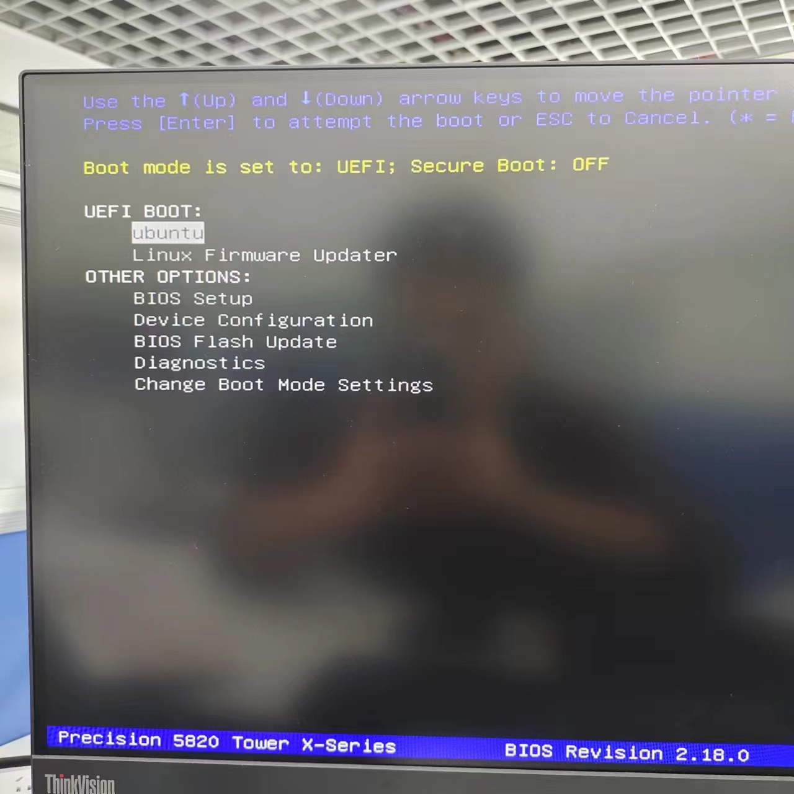
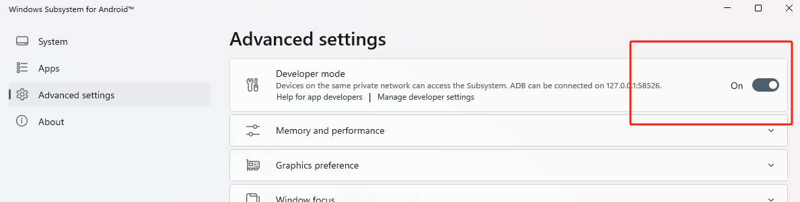

# Linux维修

按 F12 进入启动选项



UEFI BOOT：ubuntu启动

按`shift`可以进入grub管理界面

选择 recovery

grub管理界面，可以打开`Terminal`

打开终端后

重启网络

```bash
sudo systemctl restart NetworkManager
ip a
ping baidu.com
```


## 重装系统

1.下载Ubuntu系统

https://ubuntu.com/download/alternative-downloads

desktop iso镜像

2.用rugus软件制作U盘启动盘

3.在服务器上安装

4.新电脑配置


# WSL

网络

NAT


# VNC


Remote-Java-Corner-People

教程

https://blog.csdn.net/qq_63320529/article/details/134506820

192.168.31.144:5900

# 无线主机，电脑音频视频

参考投影仪

HDMI日常速率


抖音直播速率：20Mbps

讲解高清流畅直播间所需带宽，从视频音频编码讲起，好文

https://zhuanlan.zhihu.com/p/461802189


# linux运维

关闭有线网络，保留WIFI

## 管理面板

宝塔面板

Input:

```bash
sudo bt default
```

Output:

```

==================================================================
BT-Panel default info!
==================================================================
外网面板地址: http://116.7.245.186:38199/9ea09f6e
内网面板地址: http://192.168.31.144:38199/9ea09f6e
username: 5aeeguhx
password: 6759829b
Warning:
If you cannot access the panel,
release the following port (8888|888|80|443|20|21) in the security group
注意：初始密码仅在首次登录面板前能正确获取，其它时间请通过 bt 5 命令修改密码
==================================================================

```


1panel

```

[1Panel Log]:
[1Panel Log]: =================感谢您的耐心等待，安装已经完成==================
[1Panel Log]:
[1Panel Log]: 请用浏览器访问面板:
[1Panel Log]: 外网地址: http://116.7.245.188:14003/73975ab2db
[1Panel Log]: 内网地址: http://192.168.31.144:14003/73975ab2db
[1Panel Log]: 面板用户: 4a98e7279a
[1Panel Log]: 面板密码: 3e2bf90999
[1Panel Log]:
[1Panel Log]: 项目官网: https://1panel.cn
[1Panel Log]: 项目文档: https://1panel.cn/docs
[1Panel Log]: 代码仓库: https://github.com/1Panel-dev/1Panel
[1Panel Log]:
[1Panel Log]: 如果使用的是云服务器，请至安全组开放 14003 端口
[1Panel Log]:
[1Panel Log]: 为了您的服务器安全，在您离开此界面后您将无法再看到您的密码，请务必牢记您的密码。
[1Panel Log]:
[1Panel Log]: ================================================================

```

重启

```bash
1pctl restart
```


### WSL


## 防火墙

在局域网内一直不能被我的主机访问，试了很多次打开`ufw`和`iptable`都不行

后来查询了一下使用的是什么防火墙

```bash
sudo systemctl list-units --type=service | grep -i 'firewall\|ufw\|iptables'
```

根据输出，可以判断系统上正在运行的防火墙服务。

```
firewalld.service                                     loaded active running firewalld - dynamic firewall daemon                                                                                             
  ufw.service                                           loaded active exited  Uncomplicated firewall     
```

才发现用的是`firewalld`，把它禁止了就能连了

这个防火墙比`ufw`更专业，新手用`ufw`

### 常用命令

**启用防火墙**：

```
sudo ufw enable
```

**禁用防火墙**：

```
sudo ufw disable
```

**查看防火墙状态**：

```
sudo ufw status
```

**允许特定端口的进入流量**：

```
sudo ufw allow <port_number>
```

**允许特定协议和端口的进入流量**：

```
sudo ufw allow <port_number>/<protocol>
```

例如，允许 TCP 协议的 80 端口：

```
sudo ufw allow 80/tcp
```

**允许特定 IP 地址的进入流量**：

```
sudo ufw allow from <IP_address>
```

**允许特定 IP 地址的特定端口进入流量**：

```
sudo ufw allow from <IP_address> to any port <port_number>
```

**拒绝特定端口的进入流量**：

```
sudo ufw deny <port_number>
```

**删除特定规则**：

```
sudo ufw delete <rule_number>
```

可以通过 `sudo ufw status numbered` 命令查看规则编号。

**重置所有规则为默认设置**：

```
sudo ufw reset
```

**查看详细信息**：

```
sudo ufw show listening
```

### iptables

- `iptables` 是一个用于配置内核防火墙的工具，没有自己的守护进程或服务。
- 通过运行 `sudo iptables -L` 查看当前配置的防火墙规则。
- 使用 `sudo iptables -L -v -n` 获取详细的规则信息。
- 检查 `netfilter-persistent` 或 `iptables-persistent` 服务来查看规则是否在系统启动时加载。

通过这些方法，你可以确认 `iptables` 是否正在配置和使用中。

# Windows for Android

视频教程

https://www.youtube.com/watch?v=UDS0VCA38XY&ab_channel=%E5%A4%A9%E5%A4%A9%E7%A7%91%E6%8A%80%E6%95%99%E5%AD%A6


下载地址：

安卓子系统下载地址：https://github.com/MustardChef/WSABuilds

备用下载地址：
https://github.com/MustardChef/WSABuilds/releases/download/Windows_11_2307.40000.6.0/WSA_2307.40000.6.0_x64_Release-Nightly-MindTheGapps-13.0-RemovedAmazon.7z

*请将“备用下载地址”复制到迅雷下载，速度可能会更快。
如果网站打不开，或者下载速度很慢，请换个时间再下载。

### 注意事项

1.打开Developer mode，才能安装应用



2.使用WSATools安装Clash的apk文件，翻墙后才能登录谷歌


# 姿态检测

openpose

仓库：https://github.com/Hzzone/pytorch-openpose

博客：https://blog.csdn.net/liaoqingjian/article/details/115366866?utm_source=app&app_version=4.15.0&code=app_1562916241&uLinkId=usr1mkqgl919blen


轻量算法

仓库：https://github.com/Daniil-Osokin/lightweight-human-pose-estimation.pytorch?tab=readme-ov-file

视频：https://www.youtube.com/watch?v=4wlJ-JPFog4

# 爬虫

## 微博爬虫|

https://github.com/nghuyong/WeiboSpider

```
│  LICENSE
│  README.md
│  requirements.txt
│
├─.github
│      cookie.png
│      weibospider.png
│
└─weibospider
    │  cookie.txt
    │  middlewares.py
    │  pipelines.py
    │  run_spider.py
    │  settings.py
    │
    └─spiders
            comment.py
            common.py
            fan.py
            follower.py
            repost.py
            tweet_by_keyword.py
            tweet_by_tweet_id.py
            tweet_by_user_id.py
            user.py
            __init__.py

```


## 社交媒体爬虫

https://github.com/NanmiCoder/MediaCrawler

**小红书爬虫**，**抖音爬虫**， **快手爬虫**， **B站爬虫**， **微博爬虫**...。
目前能抓取小红书、抖音、快手、B站、微博的视频、图片、评论、点赞、转发等信息。

原理：利用[playwright](https://playwright.dev/)搭桥，保留登录成功后的上下文浏览器环境，通过执行JS表达式获取一些加密参数 通过使用此方式，免去了复现核心加密JS代码，逆向难度大大降低


## 微信

https://github.com/LC044/WeChatMsg


## 抖音视频直播


## MongoDB

教程

https://www.bilibili.com/video/BV16u4y1y7Fm/?spm_id_from=333.337.search-card.all.click&vd_source=dbfbd2872facf9ea60b8e6ab59de8c48


08PQi5Vx8ZaRyAWw


```bash
mongosh "mongodb+srv://cluster0.chmpdxv.mongodb.net/" --apiVersion 1 --username lzhdelife --password 08PQi5Vx8ZaRyAWw
```


# 博客

https://github.com/NanmiCoder/vanblo


# 微信公众号机器人


https://github.com/barry-ran/werobot

我的微信公众号后台

主要功能（期待更多功能可以直接提建议给公众号）：

- vip视频解析
- 电影搜索
- 图片转文字
- 技术文章


# 服务器

Linux服务器管理面板

https://github.com/1Panel-dev/1Panel


# 区块链

### 区块包含：

时间戳

哈希

前一个区块的哈希

数据

### 哈希

1.可以通过哈希算法概括区块所包含的所有信息

2.哈希值相当于区块的ID值

3.检查区块包含信息的完整性

实现细节

将时间戳 int64 转为 字节串


### 字符串

Go语言 UTF-8编码标识的Unicode文本

所有中文在 GBK 里，全世界都编入 Unicode 中

#### UTF-8讲解

Unicode 统一了所有字符的编码，是一个 Character Set，也就是字符集，字符集只是给所有的字符一个唯一编号，但是却没有规定如何存储，一个编号为 `65` 的字符，只需要一个字节就可以存下，但是编号 `40657` 的字符需要两个字节的空间才可以装下，而更靠后的字符可能会需要三个甚至四个字节的空间。

这时，用什么规则存储 Unicode 字符就成了关键，我们可以规定，一个字符使用四个字节存储，也就是 32 位，这样就能涵盖现有 Unicode 包含的所有字符，这种编码方式叫做 UTF-32（UTF 是 UCS Transformation Format 的缩写）。UTF-32 的规则虽然简单，但是缺陷也很明显，假设使用 UTF-32 和 ASCII 分别对一个只有西文字母的文档编码，前者需要花费的空间是后者的四倍（ASCII 每个字符只需要一个字节存储）。

在存储和网络传输中，通常使用更为节省空间的变长编码方式 UTF-8，UTF-8 代表 8 位一组表示 Unicode 字符的格式，使用 1 - 4 个字节来表示字符。

UTF-8 的编码规则如下（U+ 后面的数字代表 Unicode 字符代码）：

```text
U+ 0000 ~ U+ 007F: 0XXXXXXX
U+ 0080 ~ U+ 07FF: 110XXXXX 10XXXXXX
U+ 0800 ~ U+ FFFF: 1110XXXX 10XXXXXX 10XXXXXX
U+10000 ~ U+1FFFF: 11110XXX 10XXXXXX 10XXXXXX 10XXXXXX
```

可以看到，UTF-8 通过开头的标志位位数实现了变长。对于单字节字符，只占用一个字节，实现了向下兼容 ASCII，并且能和 UTF-32 一样，包含 Unicode 中的所有字符，又能有效减少存储传输过程中占用的空间。

#### 字符串demo

```go
func main() {
	var str string
	str = "Leo"
	fmt.Printf("%T, %s", str, str)
}
```

Out:

```
string, Leo
```


#### 字符串拼接bytes.Join

```go
func Join(s [][]byte, sep []byte) []byte
```

第一个参数 s 为字节数组 的 数组，第二个参数是分隔符

返回值是 将这些数组 连接成 一个数组

```go
package main

import (
    "bytes"
    "fmt"
)

func main() {
    s := [][]byte{[]byte("foo"), []byte("bar"), []byte("baz")}
    fmt.Printf("%s", bytes.Join(s, []byte(", ")))
}
```

Out:

```go
foo, bar, baz
Process finished with the exit code 0
```

### receiver函数

GO语言虽然不支持面向对像语法元素,比如类,对像,继承等,但Go语言也有方法.和函数相比,Go语言中的方法在声明形式上仅仅多了一个参数,称之为[receiver参数](https://www.zhihu.com/search?q=receiver参数&search_source=Entity&hybrid_search_source=Entity&hybrid_search_extra={"sourceType"%3A"article"%2C"sourceId"%3A"570714405"}).
receiver参数是方法与类型之间的纽带.
方法声明如下:

```go
func (receiver T/*T) MethodName(参数列表)(返回值列表){
    ...
}
```

上面方法声明中的T称为receiver 的基类型.通过receiver,上述方法被绑定到类型T上,换句话说,上述方法是类型T的一个方法,通过类型T或*T的实实例调用该方法.

作者：胡新培
链接：https://zhuanlan.zhihu.com/p/570714405
来源：知乎
著作权归作者所有。商业转载请联系作者获得授权，非商业转载请注明出处。

Go中保留了结构体，Go中的面向对象设计：

| Go           | Java |
| ------------ | ---- |
| 结构体       | 类   |
| 结构体变量   | 对象 |
| receiver函数 | 方法 |

